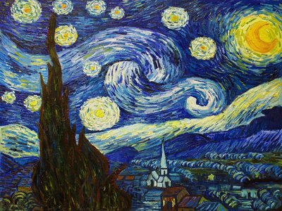
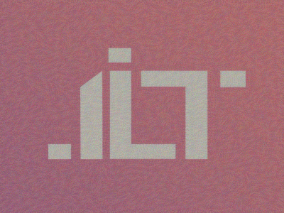
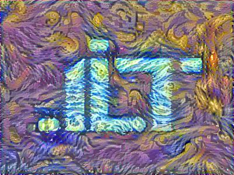

# Art-Generation-with-neural-networks
A style transfer python script, based on deep learning, that is able to apply a new style to an image while still preserving its original content.

## Implementation Details
This implementation of style transfer uses TensorFlow to train a style transfer network, using the VGG19 pretrained model on ImageNet.
### Step1 :
Before trying the model, download the pretrained model from [here](https://www.kaggle.com/teksab/imagenetvggverydeep19mat#imagenet-vgg-verydeep-19.mat) and extract it to the folder ('pretrained-model').
### Step 2 : 
Add both your content image and style image to the folder ('images') and make sure to [resize](http://picresize.com/) them to 400x300 and rename them respectively to my_content and my_style or you can just edit the code to use the names you like : 
```
content_image = scipy.misc.imread("images/your_image_here.jpg")
style_image = scipy.misc.imread("images/your_style_here.jpg")
```
### Step 3 : 
in the line 69 of style.py , the number of itereration by default is 400 , if you're using your own datasets, try this number and then more iterations to check the best performance !
```
def model_nn(sess, input_image, num_iterations = 400):
```
### Step 4 :
Make sure to install all the required libs and then run : 
```
python style.py
```
## Exemple : 
the input images (content and style) : 
<p align = 'center'>
  
  
</p>
The results : 
- iteration 0 :
<p align = 'center'>
  
</p>
- iteration 400:
<p align = 'center'>
  
</p>
you can check in the output folder the images generated after each 20 iteration .

### Attributions
- Some readme/docs formatting was borrowed from longstorm [fast style transfer](https://github.com/lengstrom/fast-style-transfer)

